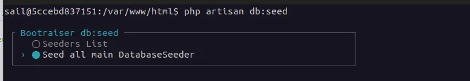

# Bootraiser

Booting Utility for Laravel custom Packages

### Features

* Bootraiser saves you all the boilerplate required for a Laravel package.
* Bootraiser can be easily integrated into existing packages.
* Bootraiser is completely based on laravel
* no “extra-magic” packages necessary

If you write your own Laravel packages, parts of your package usually have to be booted in Laravel.

This can sometimes cost an unnecessary amount of time.

Filefabrik-Bootraiser provides you with all important Laravel boot methods immediately and without much configuration
effort.
It is also quite cool if the Laravel “publish” methods are supported so that views|translations|packageConfig overrides can be
published later.

* github-project: https://github.com/Filefabrik/bootraiser
* packagist.org: https://packagist.org/packages/filefabrik/bootraiser

**current state is "dev". there are no tests. but they are under construction**

Installation:

```shell
composer require filefabrik/bootraiser
```

If you only want to use Bootraiser during development, integrate the bootraiser package with:

```shell
composer require filefabrik/bootraiser --dev
```

Then please remember to implement your own boot mechanisms
or copy the boot mechanisms you need from the Bootraiser-Trait into your `YourPackageServiceProvider`

## Modify your YourPackageServiceProvider.php

Then go to your provider file, which is usually under:

`~/packages/your-package/src/Providers/YourPackageServiceProvider.php`

YourPackageServiceProvider.php file looks like this:

```php
<?php

namespace YourCompanyVendor\YourPackage\Providers;

use Filefabrik\Bootraiser\WithBootraiser;
use Filefabrik\Bootraiser\Support\PackageConfig;
use Illuminate\Support\ServiceProvider;

class YourPackageServiceProvider extends ServiceProvider
{
    // insert this Magic Trait :)
    use WithBootraiser;

    public function register()
    {
    }

    public function boot(): void
    {
       // parts to boot if they are already exists in your code 
       $bootParts = [
            'Seeders',
       	    'Routes',
			'Migrations',
			'Translations',
			'Views',
			'Commands', 
			'Config',
            // 3rd Party package
			'Livewire',
		];
 
        /* Easy boot utility. You can replace all the booted service/parts with your own*/
       $this->bootraiserBoot($bootParts);
    }

}
```

1. To use Bootraiser, `use WithBootraiser;` must be included.

2. Then which components you want to boot with Bootraiser as an Array.

Note: You can enter all parts as boot parts. Bootraiser only boots the parts that are actually in your package.

## Split Bootraiser Boot process

Subdivide the boot process with boot raiser if needed.

```php
<?php 
...
public function boot(): void
    {
       
       // parts to boot if they are already exists in your code 
       $bootParts = [
            'Seeders',
       	    'Routes',   
       	    'Migrations',   
       	    'Translations',
		];
 
        /* Easy boot utility. You can replace all the booted service/parts with your own*/
       $this->bootraiserBoot($bootParts);
       
       /**
        * your custom boot stuff
        */
       
       // boot the rest if need 
       $bootParts2 = [
            'Views',
            'Commands',
            'Config',
            // 3rd Party package
            'Livewire',
            ];
       $this->bootraiserBoot($bootParts2);
    }
...
?>
```

The following boot mechanisms are available to you:

### boot `Routes`

`packages/your-package/routes/web.php`

@see https://laravel.com/docs/11.x/packages#routes

### boot `Migrations` (publish migrations into Laravel migration directory)

Offers migration files for publishing `packages/your-package/database/migrations/*`

```shell
php artisan vendor:publish --tag=your-package-migrations
```

@see https://laravel.com/docs/11.x/packages#migrations

#### integrate `Migrations` without publishing

It is not necessary to publish the migration files of the package. Bootraiser can make the migrations available for each
package individually in the command `php artisan migrate:status`

To do this, place the following snippet in your register or boot method

```php
 public function register(){
    $this->bootraiserIntegrate('Migrations')
 }
```

#### without integrating Migrations


#### with integrate Migrations


### boot `Translations` (Language-Files)

`packages/your-package/lang/*`

```shell
php artisan vendor:publish --tag=your-package-translations
```

https://laravel.com/docs/11.x/packages#language-files

### boot `Views` (blade) and View Components

* loadViews
* publish your blade files for overrides if need

```shell
php artisan vendor:publish --tag=your-package-views
```

* register your package to view components

@see https://laravel.com/docs/11.x/packages#views

### boot `Commands`

Boot your commands if any are existing, and if you handle laravel at the moment with cli

`packages/your-package/src/Console/Commands`

@see https://laravel.com/docs/11.x/packages#commands

### boot `Config`

`packages/your-package/packageConfig/packageConfig.php`

```shell
php artisan vendor:publish --tag=your-package-packageConfig
```

`packageConfig` is singular!

will output to `packageConfig/your-package.php` or with custom `$bootraiserPackage->setGroupName('cooler')` to `packageConfig/cooler.php`

### register `Config`

please see under [Advanced usage](#advanced-usage) for a little bit more functionality

### boot `Livewire`

If you create your own Livewire views, Livewire is also supported and booted.

* blade directory: `packages/your-package/resource/views/livewire/*`
* Livewire Component Directory `packages/your-package/src/Livewire/`

boot livewire will support the dotted namespaces (will also work without the paxsy generator)


Booting Livewire will also be displayed in Laravel's debug-bar


note: Laravel Debug-Bar can be installed via 
```shell
composer install barryvdh/laravel-debugbar --dev
```


### A note on vendor:publish --tag=“your-package”-views|translations|migrations

If your package name is too long or cumbersome to create a memorable group name, simply set a different identifier for
the group names

```php
<?php 
...
$this->bootraiserPackage()->setGroupName('cooler');
?>
```

Now all your publish tag options will look like `--tag=cooler-views`

```shell
php artisan vendor:publish --tag=cooler-views
```

### command bootraiser:seed

The bootraiser:seed command gets a menu with Bootraiser:

```shell
php artisan bootraiser:seed
```


Choose a seeder that you would like to perform


So that you can execute database seeders for packages, the db:seed command has been extended by the following options.

#### `--main` database Seeders

All DatabaseSeeder.php they are tracked by Bootraiser will be executed `--main`



```shell
php artisan bootraiser:seed --main
```

With the `--main` flag all DatabaseSeeder are executed in DatabaseSeeder.php.

For example, all executed DatabaseSeeders:

The Laravel Application Seeder

* ~./database/seeders/DatabaseSeeder.php

And for packages they are using bootraiser:

* ~./packages/my-package/database/seeders/DatabaseSeeder.php
* ~./app-paxsy/another-package/database/seeders/DatabaseSeeder.php

@see https://laravel.com/docs/11.x/seeding#running-seeders

## Advanced usage

If you want to make your packageConfig publishable,
you would also have to adapt the YourServiceProvider::register() as follows

While using in YourServiceProvider the register(), and boot() methods use a better the following Schema:

```php
<?php

namespace YourCompanyVendor\YourPackage\Providers;

use Filefabrik\Bootraiser\WithBootraiser;
use Filefabrik\Bootraiser\Support\PackageConfig;
use Illuminate\Support\ServiceProvider;

class YourPackageServiceProvider extends ServiceProvider
{
    // insert this Magic Trait :)
    use WithBootraiser;    
    
    // 
    public function register()
    {
        $this->bootraiserRegister(['Config']);
    }

    public function boot(): void
    {
       // parts to boot if they are already exists in your code 
        // parts to boot if they are already exists in your code 
       $bootParts = [   
            'Seeders',
       	    'Routes',   
       	    'Migrations',   
       	    'Translations',
		];
 
        /* Easy boot utility. You can replace all the booted service/parts with your own*/
       $this->bootraiserBoot($bootParts);
       
       /**
        * your custom boot stuff
        */
       
       // boot the rest if need 
       $bootParts2 = [
            'Views',
            'Commands',
            'Config',
            // 3rd Party package
            'Livewire',
            ];
       $this->bootraiserBoot($bootParts2);
    }

}
```

https://laravel.com/docs/11.x/packages#default-package-configuration

### Events

Bootraiser handles also package events by the following conventions.

* the Package must contain under `/src/Providers/` a service provider which extends the Laravel `EventServiceProvider` Class
* Insert `"Filefabrik\\BootraiserDemo\\Providers\\BootraiserDemoEventServiceProvider"` into the Package composer.json 

##### BootraiserDemoEventServiceProvider EventServiceProvider 
```php
<?php

namespace Filefabrik\BootraiserDemo\Providers;

use Filefabrik\Bootraiser\WithBootraiserEvent;
use Illuminate\Foundation\Support\Providers\EventServiceProvider;

class BootraiserDemoEventServiceProvider extends EventServiceProvider
{
    // Magic for Events
    use WithBootraiserEvent;

    public function register()
    {
        // call parent::register() is mandatory!
        parent::register();
        $this->bootraiserRegister('Events');
    }
}

```

##### package composer.json

```json lines
...
"extra": {
        "laravel": {
            "providers": [
                "Filefabrik\\BootraiserDemo\\Providers\\BootraiserDemoServiceProvider",
                "Filefabrik\\BootraiserDemo\\Providers\\BootraiserDemoEventServiceProvider"
            ]
        }
    }
...
```

Remember to run the Laravel Host composer.json 
```shell
composer update
```


## Todos

* for each vendor/package using bootraiser gives the ability to show all publish-tags within the package used/enabled.
  So developers' Documentation of the package can be written easier. Something like this:

```shell
php artisan bootraiser:show {packagename}
```

* If there are many own custom packages, maybe it is good to allow caching the bootraiser booting-parts. So the
  discovering/booting/registering of own packages will be faster in live-environments.
* In conjunction with caching, enable or disable a package from caching. The reason is, you are developing in the
  specific package, other packages are not under development.
* for env.testing the migrations should be available to the testing database but not to be published.

todo reflection command to show which laravel-components are inside such as seeder or livewire or or or.
todo default database seeder in a package is the class `DatabaseSeeder` from there the method db:seed has to be run
todo with explizit class name, the explizit class will be run
todo with flag --package or and with a class in the package directory
todo describe db seeder (with "")
`php artisan db:seed "\DemoPackage\TryCommandOptions\Database\Seeders\MySeeder"`
`php artisan db:seed --class="\DemoPackage\TryCommandOptions\Database\Seeders\MySeeder"`


* todo migrations
* own migrations such as bootraiser:migrate
* display packages migrations, allow refresh with paths from selecting. with display the console command. during package development, table migrations are often changed 
* bootraiser should become a "once" method with them EventServiceProvider or FancyServiceProvider cannot call the same "booting" command again
* a global config outside the package with this, developers are able to disable or enable "boot" methods they are hardcoded in the package.
* split load migrations from publishing migrations 
